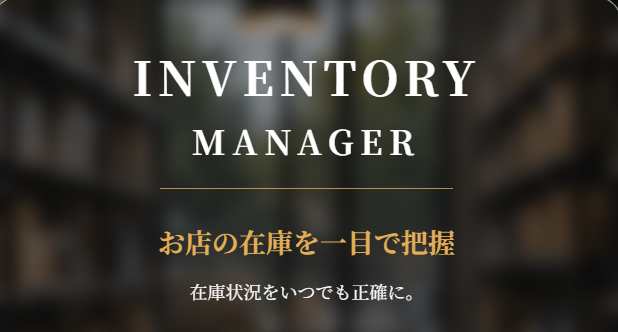
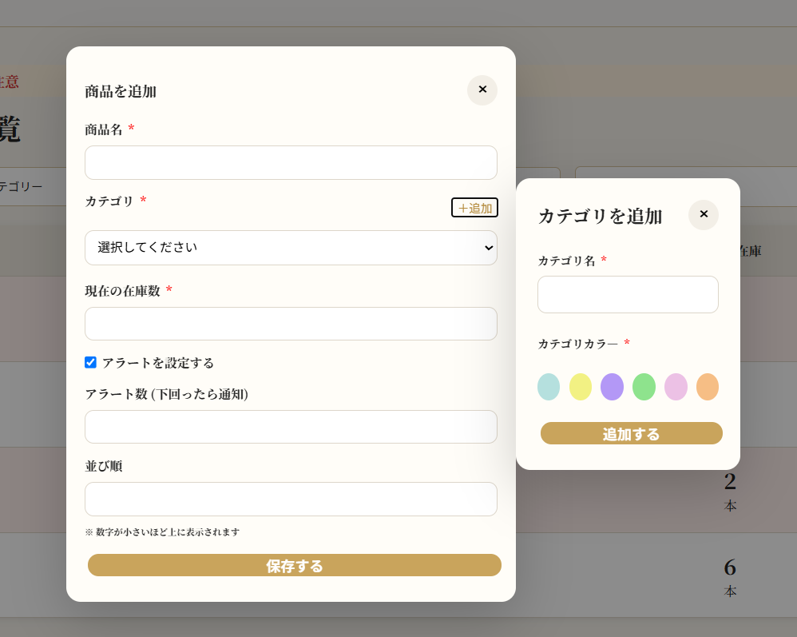
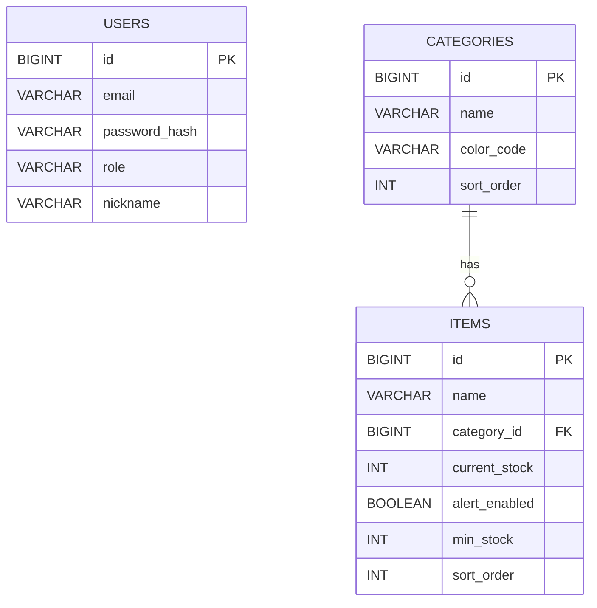

## 概要

店舗で使用する商品の在庫を管理するWebアプリです。

商品ごとの在庫数を簡単に確認・更新できるほか、
設定した基準値を下回った商品を在庫注意として確認できるようにすることで、
発注が必要な商品の見落としを防ぎ、店舗の在庫管理を効率化します。

## 制作背景

美容師として働く中で、在庫確認や発注作業に手間がかかることに加え、
在庫が少なくなっていることに気づくのが遅れ、
商品が必要になったタイミングで在庫切れが発覚し、その際に他店舗へ
商品を借りに行くこともあり、在庫管理の非効率さを課題に感じていました。

そこで、商品の在庫数を簡単に確認・更新でき、
在庫が少なくなった商品を把握できる在庫管理アプリを制作しました。

# 要件定義

## 機能要件

- 商品が登録・編集・削除できること（カテゴリーごとに分類）
- 在庫数が見られること
- 商品名で検索できること
- カテゴリーに分類して見られること
- 商品ごとに並び替えが好きなように編集できること
- スタッフが使用した分の在庫を減算登録できること
- 入庫した分の在庫を加算できること
- 在庫の数が目安数よりも下回ったら分かるようにすること
- 在庫数が少ないものをリストとして確認できること
- 誤操作防止のため、増減操作時に確認ダイアログを表示し在庫数を増減できること
- ログイン認証により、認証されたユーザーのみ利用できること
- ゲストログイン機能
- 設定画面（プロフィール編集・パスワード変更・アラート設定等）

## 非機能要件

- スマホメインで見ることが多いがどんな端末でも崩れず表示できること
- 操作の慣れていないスタッフでも直観的に操作できること
- ユーザーの認証情報を安全に管理できること
- 在庫データを安全に管理できること

## 主な機能

- 商品の登録・編集・削除
- 商品一覧の表示
- 在庫数の少ない商品の表示
- カテゴリによる絞り込み
- 在庫数の増減・更新
- ユーザー登録とログイン・ログアウト機能

## 🔧主な使用技術

### バックエンド

- Java 21 / Spring Boot 4.1.0

### フロントエンド

- React / JavaScript / CSS

### データベース

- MySQL 8.0

### データアクセス

- Spring Data JPA

### 開発環境・ツール

- Node.js 24.19.0
- Visual Studio Code
- IntelliJ IDEA
- Postman
- Git
- GitHub

## 技術選定理由

### Spring Boot

Javaでのバックエンド開発を学習することを目的として採用しました。
また、REST APIを構築しやすく、将来的な認証機能やデータベース連携にも対応しやすい点を考慮しました。

### React

商品行や在庫増減ボタンなど、同じUIパーツを繰り返し使う場面が多く、
また在庫数や商品一覧など、画面の状態が頻繁に変化するため、
コンポーネント単位でUIを管理でき、状態の変化に応じて画面を自動更新できる
Reactを採用しました。

## 工夫した点

### 在庫数を直感的に確認できるUI

在庫数だけでなく、在庫状況を視覚的に把握できるように、
在庫数に応じて表示を変えるUIを実装しました。(黄色は「注意」、赤は「危険」)

### 誤操作を防ぐ在庫変更

在庫数を増減する操作では、変更内容を確認してから確定できるようにし、
誤操作による在庫数の変更を防止しています。

### カテゴリの整理

商品テーブルにカテゴリ情報を直接持たせず、
カテゴリを別テーブルで管理することで、
カテゴリごとの色や表示順を一元管理できるようにしました。

## 苦労した点・解決策

### 在庫数の増減処理

#### 【問題】

在庫数の増減操作による誤操作を防ぐため、増減値を一時的に保持し、確認後に在庫数を変更する必要がありました。

#### 【原因】

在庫数を直接変更すると、誤操作によって意図しない在庫数になる可能性がありました。

#### 【解決策】

在庫数変更専用のAPIを用意し、フロントエンドでは増減値を一時的に状態管理する構成にして、確定時に在庫数変更APIへ送信し、バックエンドでデータベースの在庫数を更新するようにしました。
また、在庫数の変更と商品情報の更新を分けて、それぞれ別の処理として管理しました。

### Spring Security導入後のエラー処理

#### 【問題】

ユーザー登録・ログイン時のエラーを、状況に応じて適切なHTTPステータス（409・401・400）として返すようにしましたが、
まずメールアドレス重複時に409 Conflictを返す実装をしたところ、実際には403 Forbiddenが返る問題が発生しました。

#### 【原因】

Spring Bootのエラー処理で使用される/errorがSpring Securityの認証対象となっており、エラー処理時に403が返されていました。

#### 【解決策】

/errorをpermitAll()に追加することで、意図したHTTPステータスを返せるようになりました。
その上で、
- メールアドレス重複 → 409 Conflict
- ログイン認証失敗 → 401 Unauthorized 
- パスワード不一致 → 400 Bad Request

としてエラー処理を実装しました。

## 画面構成

### 商品一覧

商品の在庫状況を確認・検索・編集できます。


### 商品・カテゴリ追加(モーダル)

商品の情報や在庫数・アラート設定・並び順とカテゴリの登録ができます。



### ログイン・ユーザー登録画面

メールアドレスとパスワードでログイン、ユーザーの新規登録ができる機能です。


## 今後の実装予定

### ホーム画面　

商品の在庫状況を一目で確認できる画面を実装予定です。


### 商品編集(モーダル)画面

商品の情報や在庫数、アラート設定、並び順を編集できる機能を実装予定です。


### カテゴリ管理(モーダル)画面

カテゴリの名前、並び順、カテゴリごとのカラーを編集できる機能を実施予定です。


### 在庫注意画面

在庫がアラート基準を下回った商品を確認できる画面を実装予定です。


### 設定画面

メールアドレスやパスワード、アラート設定を変更できる画面を実装予定です。


### インフラ・デプロイ

#### AWS RDSへの移行

本番環境のデータベースをAWS RDSへ移行予定です。

#### デプロイ

バックエンドをRender、フロントエンドをNetlifyへデプロイ予定です。

## DB設計

### users

| カラム           | 内容           |
|---------------|--------------|
| id            | 主キー          |
| email         | メールアドレス      |
| password_hash | ハッシュ化したパスワード |
| role          | 権限           |
| nickname      | ニックネーム       |

### categories

| カラム        | 内容      |
|------------|---------|
| id         | 主キー     |
| name       | カテゴリ名   |
| color_code | カテゴリカラー |
| sort_order | 表示順     |

### items

| カラム           | 内容         |
|---------------|------------|
| id            | 主キー        |
| name          | 商品名        |
| category_id   | カテゴリID     |
| current_stock | 現在の在庫数     |
| alert_enabled | アラートON/OFF |
| min_stock     | アラート基準値    |
| sort_order    | 商品の並び順     |

###### ※ユーザー設計について

現在は単一店舗での利用を想定しているため、
商品・カテゴリとユーザーの直接的な関連付けは行っていません。

## 認証方式

セッション認証を使用してログイン状態を管理する予定。
パスワードはハッシュ化して保存する予定。

## ER図



## APIのURL設計

| HTTPメソッド | URL                     | 処理内容     |
|----------|-------------------------|----------|
| GET      | `/api/items`            | 商品一覧取得   |
| POST     | `/api/items`            | 商品登録     |
| PUT      | `/api/items/{id}`       | 商品更新     |
| DELETE   | `/api/items/{id}`       | 商品削除     |
| PATCH    | `/api/items/{id}/stock` | 在庫数更新    |
| GET      | `/api/categories`       | カテゴリ一覧取得 |
| POST     | `/api/categories`       | カテゴリ登録   |
| POST | `/api/auth/login` | ログイン |
| POST | `/api/auth/register` | ユーザー登録 |

## 環境構築手順

### 必要な環境

- Java 21
- Node.js 24.19.0
- MySQL 8.0
- Git

### 1. リポジトリをクローン

```bash
git clone https://github.com/jykior/inventory-app.git
```

### 2. データベースを準備

MySQLに `inventory` データベースを作成します。

```sql
CREATE DATABASE inventory;
```

テーブルは、アプリケーション起動時にJPAがエンティティ定義をもとに自動作成・更新します。

### 3. バックエンドを起動

バックエンドのディレクトリに移動し、Spring Bootを起動します。

```bash
cd inventory-app/backend
```

MySQLの接続情報を環境変数に設定します。

```
export DB_USERNAME=MySQLのユーザー名
export DB_PASSWORD=MySQLのパスワード
```

その後、Spring Bootを起動します。

```
./gradlew bootRun
```

### 5. フロントエンドを起動

別のターミナルを開き、フロントエンドのディレクトリで依存関係をインストールし,
開発サーバーを起動します。

```bash
cd inventory-app/frontend
npm install
npm run dev
```

## 開発ステータス

- ✅ 商品登録・削除
- ✅ 商品一覧表示
- ✅ カテゴリによる絞り込み
- ✅ 在庫数の増減・更新
- ✅ ログイン機能
- ✅ ログイン画面作成
- ✅ Spring Security導入
- ✅ ユーザー新規登録機能
- ⬜ ロール別権限管理
- ⬜ ゲストアカウント作成
- ⬜ 商品・カテゴリの編集
- ⬜ 商品の並び替え
- ⬜ 在庫注意画面作成
- ⬜ 在庫注意商品の表示
- ⬜ ホーム画面作成
- ⬜ AWS RDSへの移行
- ⬜ デプロイ・公開