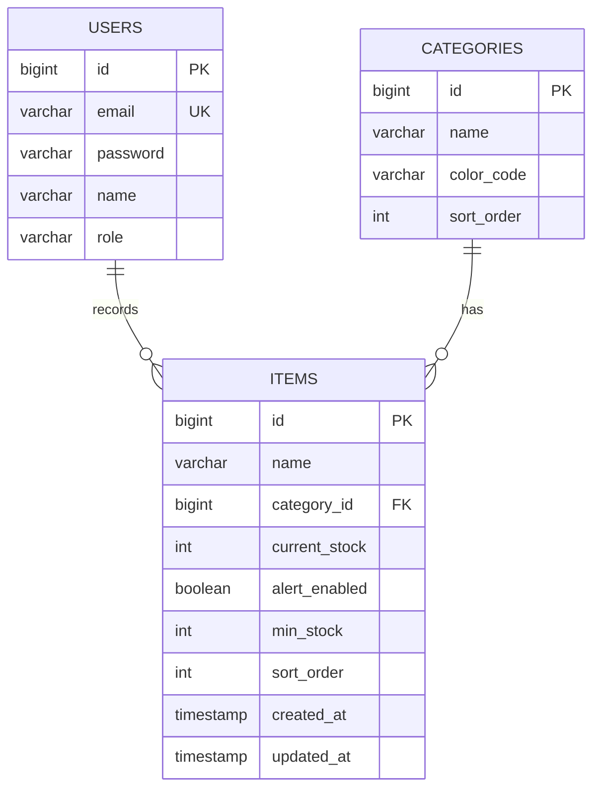

# 在庫管理システム（Inventory Manager）

お店の消耗品在庫を管理するWebアプリケーション。
店舗スタッフが在庫数を確認・更新でき、在庫下限を下回った商品をアラート表示する。

## 概要

- 元は生成AIを活用して作成したHTML/CSS/JS版のプロトタイプ
- 実務レベルのスキル習得のため、React（フロントエンド）+ Spring Boot（バックエンド）でリメイク中
- ログイン機能（Spring Securityのセッション認証）を追加し、店舗スタッフ専用の管理画面として再設計

## 背景・目的

毎週の在庫発注や毎月の棚卸しの際に、商品数を目視で一つずつ数えており、在庫が少なくなっていることに気づくのが遅れ、商品が必要になったタイミングで在庫切れが発覚し、その都度他店舗へ借りに行くこともあってとても非効率だった。日々の在庫数を簡単に確認・管理でき、在庫が少なくなった商品を事前に把握できるようにすることで、在庫管理の効率化と在庫切れの防止を目的としたアプリ。

## 要件定義

### 機能要件（実装スコープ：Phase 1）

- 商品が登録・編集・削除できること（カテゴリーごとに分類）
- 在庫数が見られること
- カテゴリごとに分類して見られること
- 商品ごとに並び替えが好きなように編集できること
- スタッフが使用した分の在庫を減算登録できること
- 入庫した分の在庫を加算できること
- 在庫の数が目安数よりも下回ったら分かるようにすること
- 在庫数が少ないものをリストとして確認できること
- 誤操作防止のため2段階認証（増減操作時に確認ダイアログを表示し、本人に最終確認させる方式）で在庫数を増減できること

### 非機能要件（実装スコープ：Phase 2以降）

- 在庫数が目安数よりも下回ったときにメールなどでアラート通知できること
- 商品名で検索できること
- スマホメインで見ることが多いがどんな端末でも崩れず表示できること
- 操作の慣れていないスタッフでも直観的に操作できること
- 発注サイトと連動して入庫数を反映できること
- 在庫データを安全に管理できること
- ゲストログイン機能（デモ体験用）
- 設定画面（プロフィール編集・パスワード変更・アラート設定等）

> まずは機能要件（コア機能）を実装し、動くものを完成させてから非機能要件を段階的に追加していく方針。

## 技術スタック

**フロントエンド**
- React
- react-router-dom（画面遷移・認証ガード）
- Context API（認証状態管理）

**バックエンド**
- Spring Boot 4.x
- Spring Security(セッション認証)
- Spring Data JPA
- MySQL

**インフラ**
- ローカル開発：MySQL（ローカル）
- 本番想定：AWS RDS（MySQL）

## ER図



## テーブル設計

### users（ユーザー）

| カラム | 型 | 説明              |
|---|---|-----------------|
| id | BIGINT PK |                 |
| email | VARCHAR UNIQUE | ログインID          |
| password | VARCHAR | BCryptハッシュ化して保存 |
| name | VARCHAR | 表示名             |
| role | VARCHAR | STAFF / GEST    |

### categories（カテゴリ）

| カラム | 型 | 説明 |
|---|---|------|
| id | BIGINT PK |      |
| name | VARCHAR | カテゴリ名 |
| color_code | VARCHAR | カテゴリドット・バッジの色 |
| sort_order | INT | タブ表示順 |

### items（商品）

| カラム | 型 | 説明 |
|---|---|----|
| id | BIGINT PK |    |
| name | VARCHAR | 商品名 |
| category_id | BIGINT FK → categories.id |    |
| current_stock | INT | 現在庫数 |
| alert_enabled | BOOLEAN | アラート設定ON/OFF |
| min_stock | INT NULLABLE | アラート下限本数 |
| sort_order | INT | カテゴリ内表示順 |
| created_at | TIMESTAMP |    |
| updated_at | TIMESTAMP |    |

## API設計

### 認証

| メソッド | パス | 説明 |
|---|---|---|
| POST | /api/auth/login | ログイン（email, password → セッション認証） |
| POST | /api/auth/logout | ログアウト |

### 商品（items）

| メソッド | パス | 説明 |
|---|---|---|
| GET | /api/items | 商品一覧取得（カテゴリ絞り込み可） |
| GET | /api/items/{id} | 商品詳細取得 |
| POST | /api/items | 商品追加 |
| PUT | /api/items/{id} | 商品編集 |
| DELETE | /api/items/{id} | 商品削除 |
| PATCH | /api/items/{id}/stock | 在庫数の増減（＋/－ボタン用） |

### カテゴリ（categories）

| メソッド | パス | 説明 |
|---|---|---|
| GET | /api/categories | カテゴリ一覧取得 |
| POST | /api/categories | カテゴリ追加 |

### 在庫アラート

| メソッド | パス | 説明             |
|---|---|----------------|
| GET | /api/items/alerts | アラート数を下回った商品一覧 |

## セットアップ（ローカル開発）

```bash
# 1. MySQLにDBを作成
CREATE DATABASE inventory CHARACTER SET utf8mb4;

# 2. application-local.properties を設定
spring.datasource.url=jdbc:mysql://localhost:3306/inventory
spring.datasource.username=root
spring.datasource.password=your_password

# 3. 起動
./gradlew bootRun --spring.profiles.active=local
```

## 開発ステータス

- [x] テーブル設計
- [ ] users エンティティ・認証API
- [ ] ログイン画面（React）
- [ ] items 一覧API・画面
- [ ] AWS RDSへの移行
