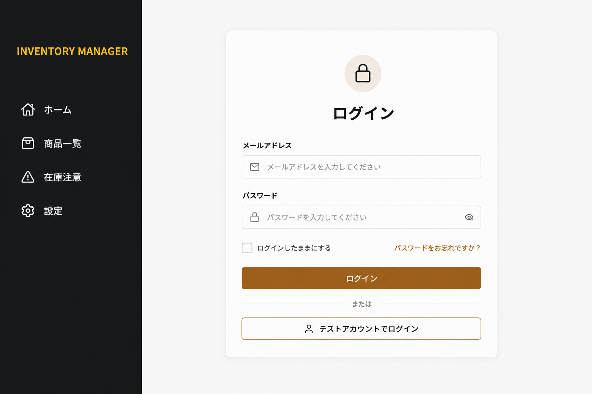
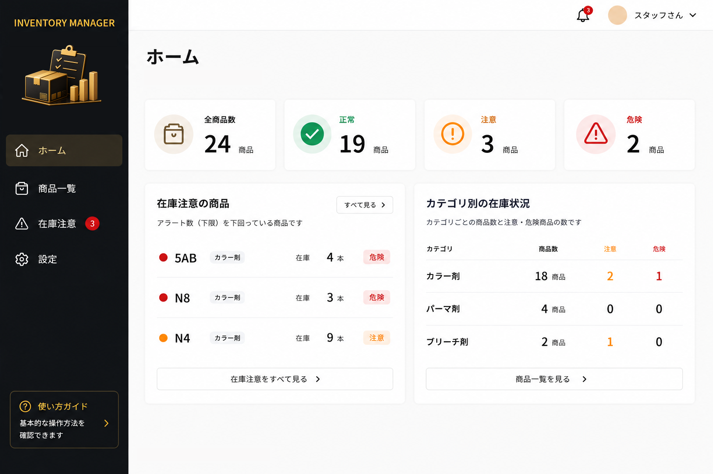
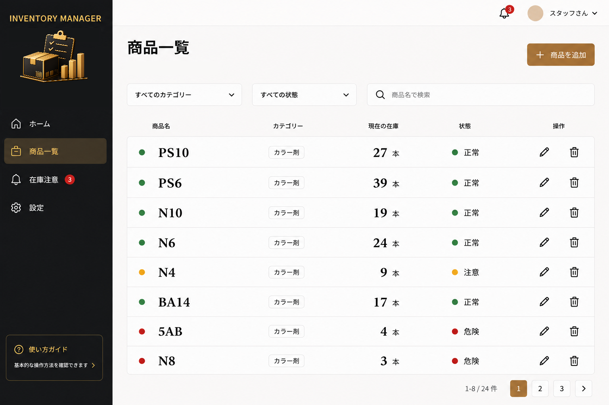
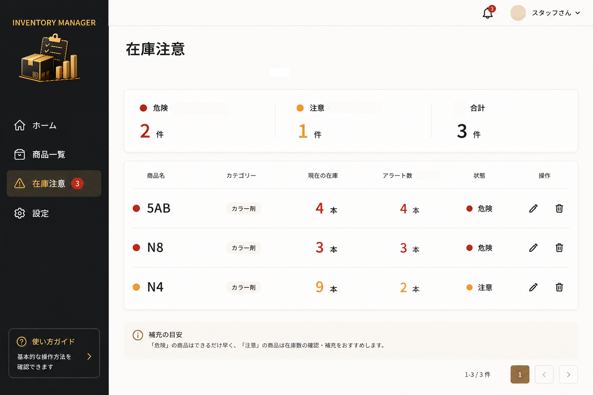
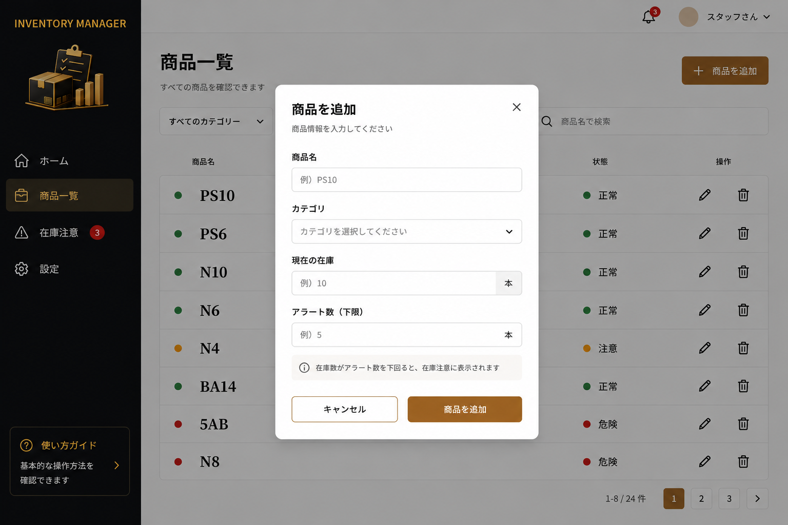
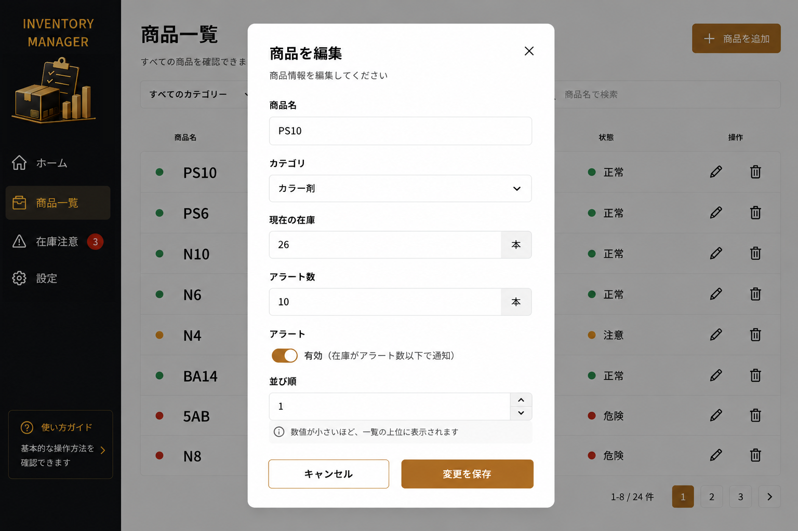
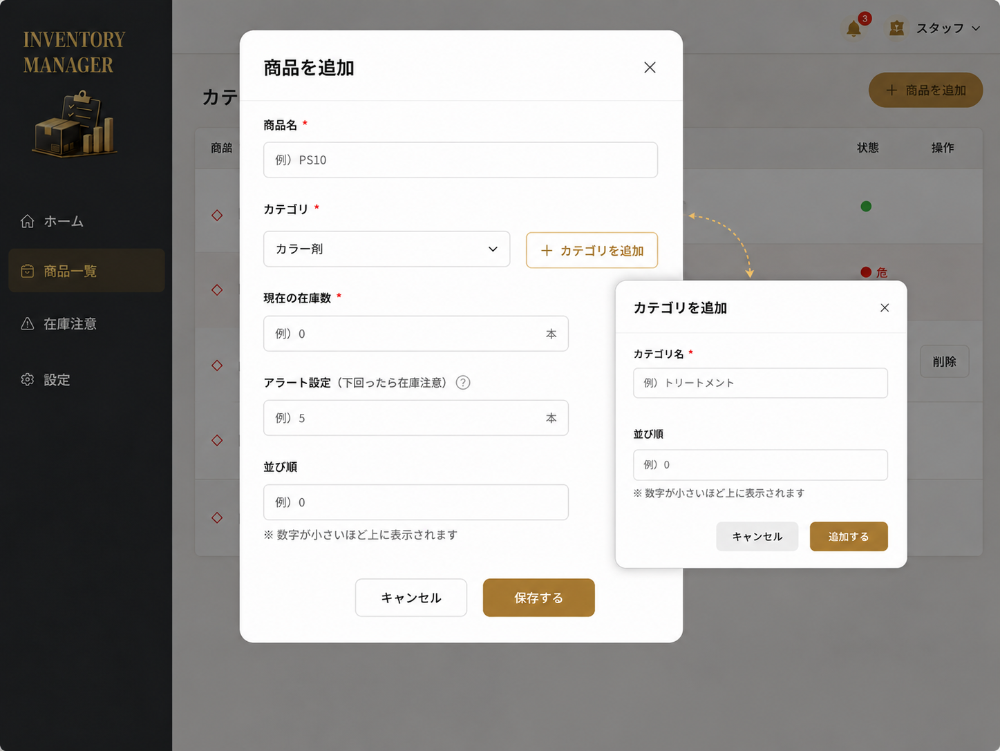
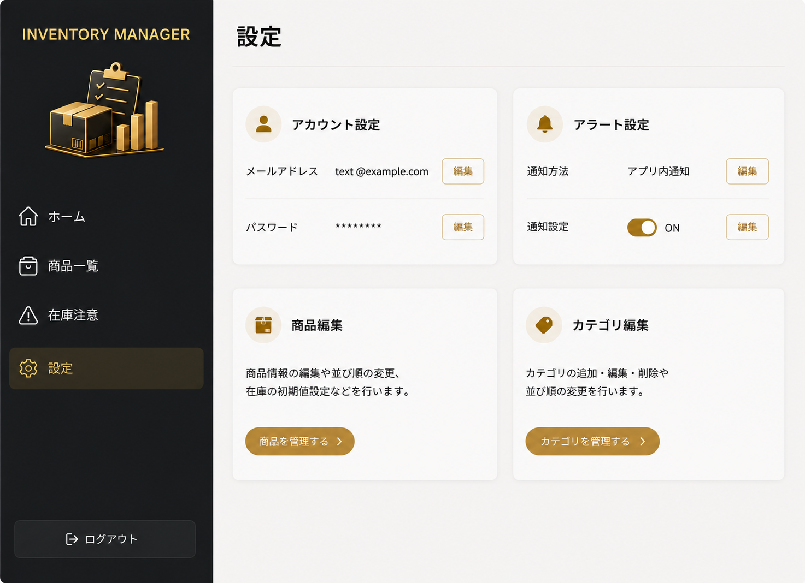
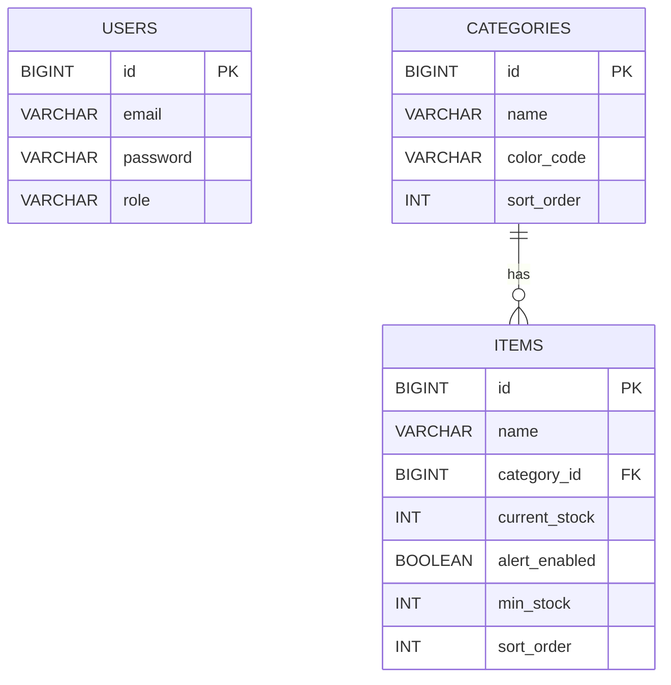

## 概要

店舗で使用する商品の在庫を管理するWebアプリです。

商品ごとの在庫数を簡単に確認・更新できるほか、
設定した基準値を下回った商品を在庫注意として確認できるようにすることで、
発注が必要な商品の見落としを防ぎ、店舗の在庫管理を効率化します。

## 制作背景

美容師として働く中で、在庫確認や発注作業に手間がかかることに加え、
在庫が少なくなっていることに気づくのが遅れ、
商品が必要になったタイミングで在庫切れが発覚し、その際に他店舗へ
商品を借りに行くこともあり、在庫管理の非効率さを課題に感じていました。

そこで、商品の在庫数を簡単に確認・更新でき、
在庫が少なくなった商品を把握できる在庫管理アプリを制作しました。

# 要件定義

## 機能要件

- 商品が登録・編集・削除できること（カテゴリーごとに分類）
- 在庫数が見られること
- カテゴリーに分類して見られること
- 商品ごとに並び替えが好きなように編集できること
- スタッフが使用した分の在庫を減算登録できること
- 入庫した分の在庫を加算できること
- 在庫の数が目安数よりも下回ったら分かるようにすること
- 在庫数が少ないものをリストとして確認できること
- 誤操作防止のため、増減操作時に確認ダイアログを表示し在庫数を増減できること
- ログイン認証で利用者以外からのアクセスを制限し、セキュリティを強化すること

## 非機能要件

- 在庫数が目安数よりも下回ったときにメールなどでアラート通知できること
- 商品名で検索できること
- スマホメインで見ることが多いがどんな端末でも崩れず表示できること
- 操作の慣れていないスタッフでも直観的に操作できること
- 発注サイトと連動して入庫数を反映できること
- 在庫データを安全に管理できること
- ゲストログイン機能（デモ体験用）
- 設定画面（プロフィール編集・パスワード変更・アラート設定等）

## 主な機能

- 商品の登録・削除
- 商品一覧の表示
- カテゴリによる絞り込み
- 在庫数の増減・更新
- 在庫注意商品の表示

## 主な使用技術

### バックエンド

- Java 21 / Spring Boot 4.1.0

### フロントエンド

- React / JavaScript / CSS

### データベース

- MySQL

### データアクセス

- Spring Data JPA

### 開発環境・ツール

- Visual Studio Code
- IntelliJ IDEA
- Git
- GitHub

## 画面構成

### ログイン　(未実装)

ユーザーがメールアドレスとパスワードでログインできます。

### ホーム　(未実装)

商品の在庫状況を一目で確認できます。

### 商品一覧

商品の在庫状況を確認・検索・編集できます。

### 在庫注意　(未実装)

在庫がアラート基準を下回った商品を確認できます。

### 商品追加・編集(モーダル)

商品の情報や在庫数、アラート設定、並び順を登録・変更、カテゴリの追加ができます。

商品編集モーダル未実装

### 設定　(未実装)

メールアドレスやパスワード、アラート設定を変更できます。

## DB設計

### users

| カラム      | 内容      |
|----------|---------|
| id       | 主キー     |
| email    | メールアドレス |
| password | パスワード   |
| role     | 権限      |

### categories

| カラム        | 内容      |
|------------|---------|
| id         | 主キー     |
| name       | カテゴリ名   |
| color_code | カテゴリカラー |
| sort_order | 表示順     |

### items

| カラム           | 内容         |
|---------------|------------|
| id            | 主キー        |
| name          | 商品名        |
| category_id   | カテゴリID     |
| current_stock | 現在の在庫数     |
| alert_enabled | アラートON/OFF |
| min_stock     | アラート基準値    |
| sort_order    | 商品の並び順     |

## ER図

## APIのURL設計

| HTTPメソッド | URL | 処理内容 |
|---|---|---|
| GET | `/api/items` | 商品一覧取得 |
| POST | `/api/items` | 商品登録 |
| PUT | `/api/items/{id}` | 商品更新 |
| DELETE | `/api/items/{id}` | 商品削除 |
| PATCH | `/api/items/{id}/stock` | 在庫数更新 |
| GET | `/api/categories` | カテゴリ一覧取得 |
| POST | `/api/categories` | カテゴリ登録 |

## 開発ステータス

- [x] 商品登録・削除
- [x] 商品一覧表示
- [x] カテゴリによる絞り込み
- [x] 在庫数の増減・更新
- [ ] 在庫注意商品の表示
- [ ] 商品・カテゴリの編集
- [ ] 商品・カテゴリの並び替え
- [ ] ログイン・認証機能
- [ ] AWS RDSへの移行
- [ ] デプロイ・公開